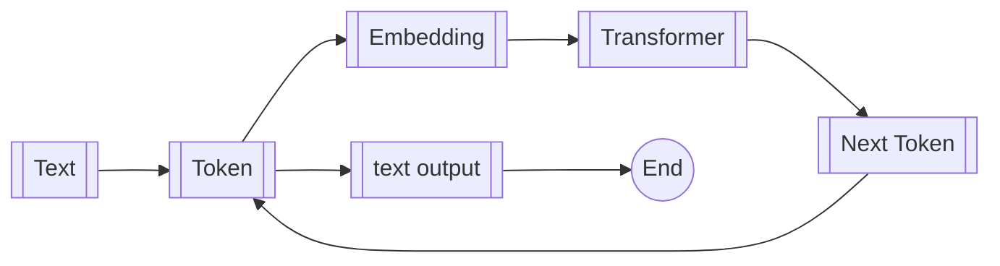

# Build a Mini GPT From Zero

## Introduction

This project explains step by step, combined with code snippets, the process from inputting text to predicting the next character and also the text sequence generation. It includes the training processes of each part.

The generation of a token in GPT can be roughly divided into the following stages:



## Setup

Clone this project.

```Bash
git clone <this_project>
cd <project_folder>
```

Setup the environment using [uv](https://docs.astral.sh/uv/getting-started/installation/).

```Bash
uv sync
```

## Training

```Bash
uv run train.py
```

Generally, it will take 4 to 5 hours.

## Generate

After done the training. This script will search the latest saved model and using it to generate.

```Bash
uv run generate.py
```

## Do it yourself

1. Generate your own configuration within `./train.py`. For detailed information, refer to the `Config` dataclass in `LLMZero/config.py`.

    ```Python
    config = Config(
        save_path="save/mini_gpt001.pth",
        tokenizer_name="SimpleBPE",
        device="cuda" if torch.cuda.is_available() else "cpu",
        max_steps=50000,
    )
    ```

2. Optional, update `data/dataset.txt.gz` with your data.
3. Train it and generate with your model.

## License

This project is MIT licensed.
